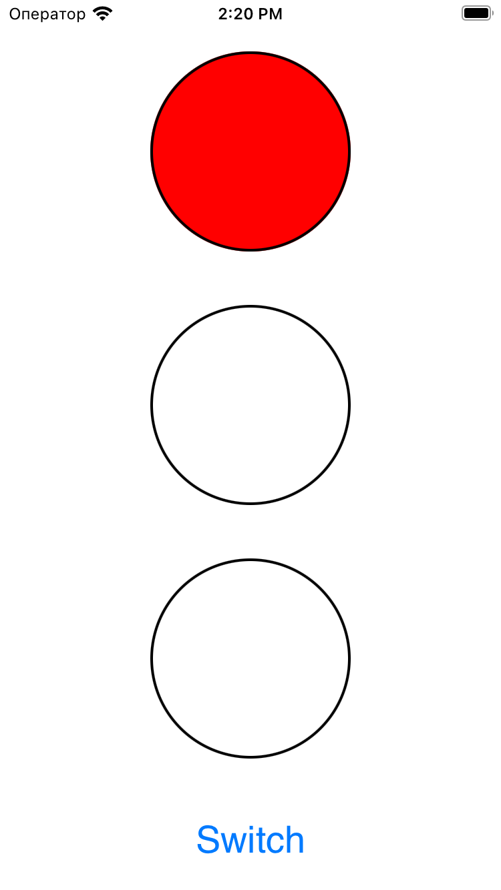
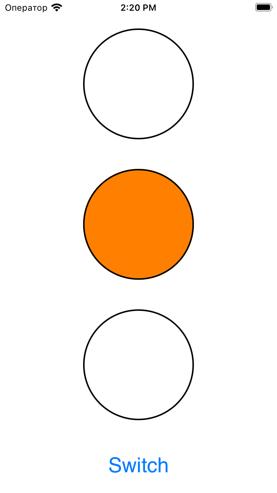
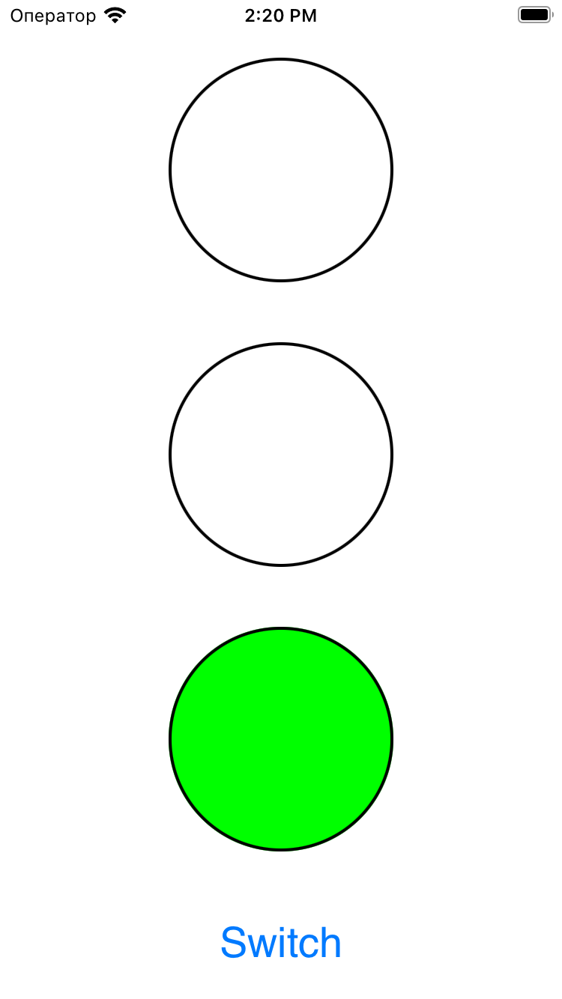
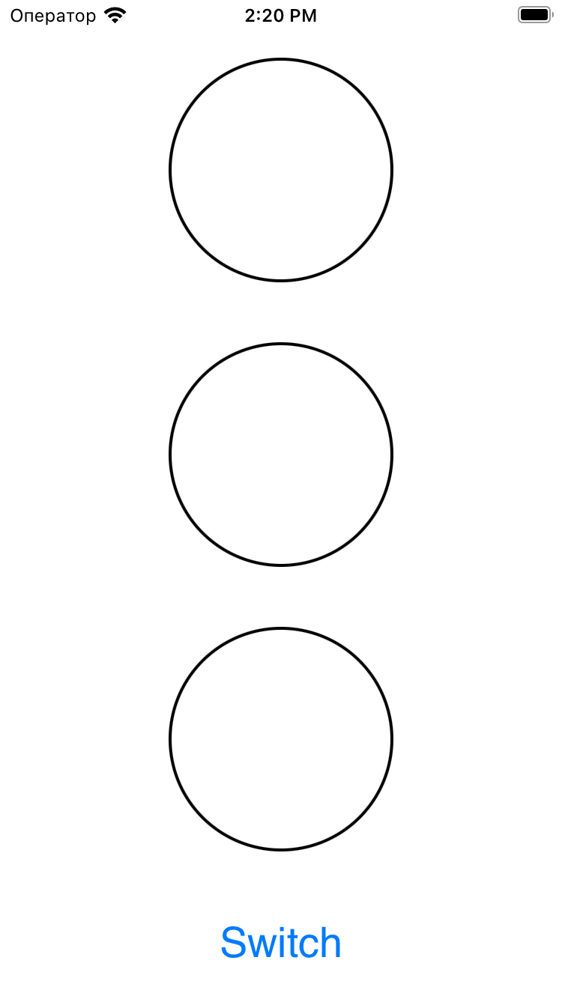

# Проект "Stoplight"

Проект "Stoplight" представляет собой простое приложение, созданное для изучения работы с `UIViewController` в iOS, а также использования интерфейса Storyboard.

## Описание проекта

Проект создан с использованием языка программирования Swift и фреймворка UIKit. Цель проекта - создать симулятор светофора с тремя цветами: красным, желтым и зеленым, а также функцией выключения.

## Структура проекта

Проект состоит из следующих компонентов:

- `Main.storyboard`: файл интерфейса, созданный в редакторе Storyboard. Содержит представления (UIView) и кнопку (UIButton) для управления светофором.
- `ViewController.swift`: исходный код контроллера, который обрабатывает логику сигналов светофора.
- `Assets.xcassets`: папка с ресурсами, такими как изображения для светофора.

## Запуск проекта

Для запуска проекта выполните следующие шаги:

1. Откройте проект в Xcode.
2. Запустите симулятор, выбрав устройство для запуска.
3. Нажмите кнопку на экране для переключения между различными цветами светофора.

## Функциональность

Светофор имеет четыре состояния:

1. **Красный свет (Red):** Запрещено движение.
2. **Желтый свет (Yellow):** Готовьтесь двигаться, светофор готовится к смене.
3. **Зеленый свет (Green):** Разрешено движение.
4. **Выключен (Off):** Светофор выключен.

  
  
  
  

## Изученные концепции

- Создание интерфейса с использованием Storyboard.
- Работа с `UIViewController`.
- Использование кнопок для управления приложением.
- Основы UIKit и UIView.
