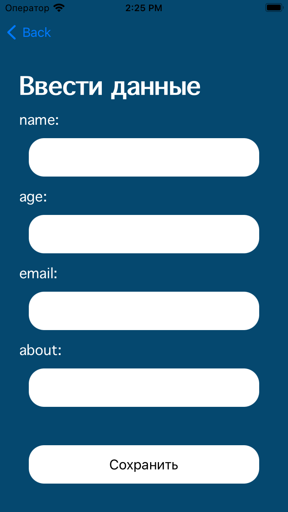
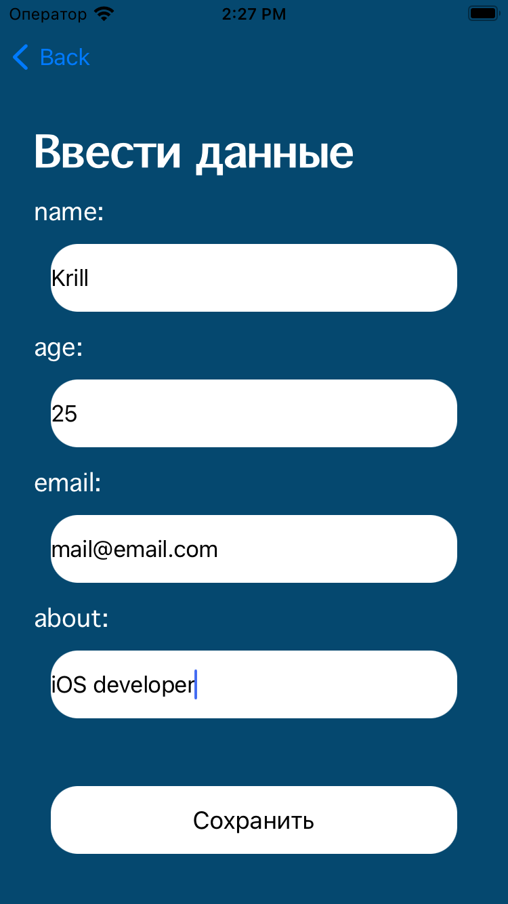
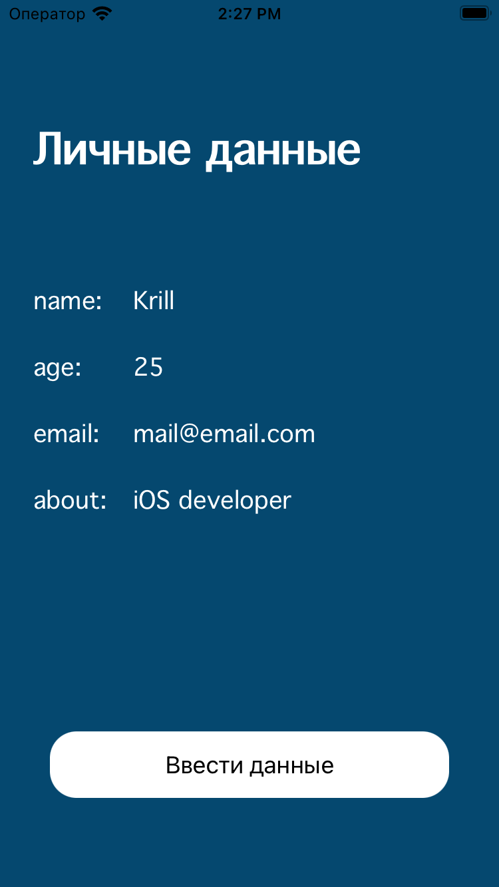

# Проект "Страница пользователя"

Проект "Страница пользователя" создан с целью изучения механизмов переходов между view и использования делегатов в iOS-разработке. Проект включает в себя страницу пользователя (ViewController) с отображением личных данных и кнопкой для ввода данных, а также второй экран (SecondViewController) для редактирования и сохранения данных.

## Описание проекта

Цель проекта - изучение переходов между view, передача данных между контроллерами, а также работа с делегатами для обновления информации на главной странице.

## Структура проекта

Проект состоит из следующих компонентов:

- `ViewController.swift`: Контроллер главной страницы, отображающий личные данные и содержащий кнопку для перехода на второй экран.
- `SecondViewController.swift`: Контроллер второго экрана, предоставляющий возможность редактирования и сохранения личных данных.
- `StudentData.swift`: Модель данных, представляющая личные данные пользователя.

## Изученные концепции

- Переходы между view с использованием `UINavigationController`.
- Передача данных между контроллерами.
- Использование делегатов для обновления информации на главной странице.

## Функциональность

- **ViewController:**
  - Отображение личных данных пользователя (name, age, email, about).
  - Пустые поля при первом запуске.
  - Кнопка "Ввести данные" для перехода на второй экран.

  

- **SecondViewController:**
  - Поля `UITextField` для ввода и редактирования данных.
  - Кнопка "Сохранить", сохраняющая введенные данные и возвращающая на главную страницу.

  
  
  

## Использование делегатов

- Для обновления данных на главной странице после редактирования в SecondViewController используется делегирование.

## Запуск проекта

Для запуска проекта выполните следующие шаги:

1. Откройте проект в Xcode.
2. Запустите симулятор, выбрав устройство для запуска.
3. Интерфейс приложения "Страница пользователя" будет отображен на экране.

