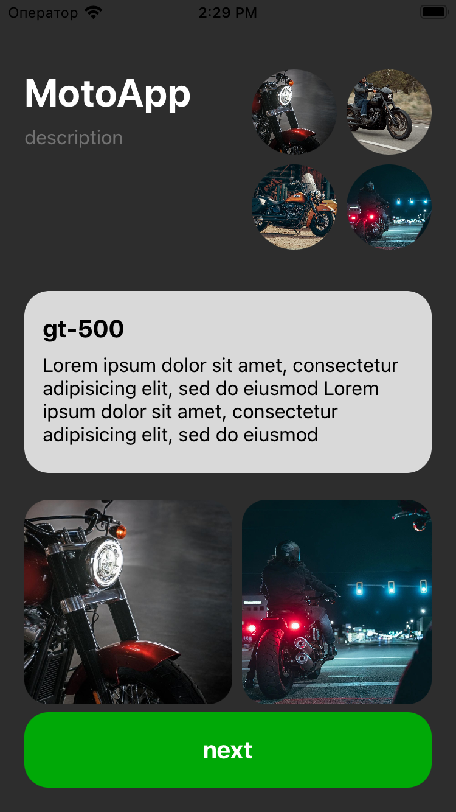

# Проект "Изучение верстки интерфейса в Storyboard"

Проект "Изучение верстки интерфейса в Storyboard" создан с целью освоения навыков работы с различными элементами интерфейса в iOS-приложениях. Проект включает в себя сложную верстку, включающую в себя тексты, картинки и заголовки.

## Описание проекта

Цель проекта - изучение возможностей и особенностей Storyboard для верстки интерфейса приложения.

## Структура проекта

Проект включает в себя следующие элементы:

- **Main.storyboard:** Файл интерфейса, созданный в редакторе Storyboard, содержащий все элементы интерфейса.
- **ViewController.swift:** Контроллер, связанный с Main.storyboard, для обработки логики и взаимодействия с элементами интерфейса.

## Изученные концепции

- Работа с различными элементами интерфейса: `UILabel`, `UIImageView`, `UIButton`, и другими.
- Использование стеков (`UIStackView`) для упорядочивания элементов.
- Группировка и выравнивание элементов с использованием контейнеров.
- Создание сложных макетов с использованием Auto Layout.
- Применение адаптивного дизайна для различных размеров экранов.

## Функциональность

Проект представляет собой набор элементов, распределенных по экрану в креативной и сложной композиции. Возможные элементы могут включать в себя:

- Текстовые блоки и заголовки.
- Изображения и иллюстрации.
- Кнопки и элементы управления.

  

## Запуск проекта

Для запуска проекта выполните следующие шаги:

1. Откройте проект в Xcode.
2. Убедитесь, что Main.storyboard выбран как основной интерфейс.
3. Запустите симулятор, выбрав устройство для запуска.
4. Интерфейс с креативной версткой будет отображен на экране.
