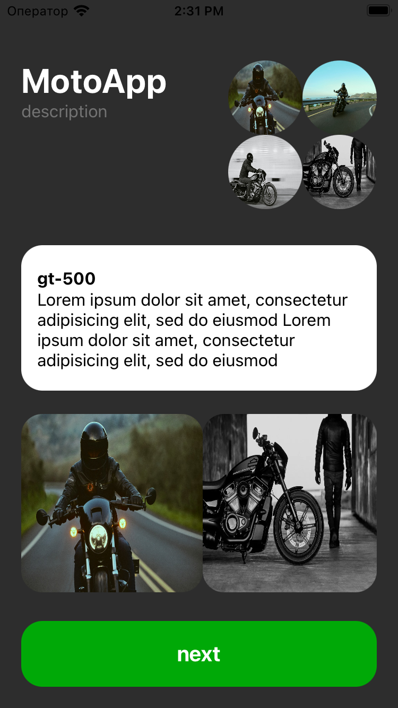

# Проект "Изучение верстки интерфейса кодом и constraint"

Проект "Изучение верстки интерфейса кодом и constraint" создан с целью освоения программной верстки интерфейса в iOS-приложениях. В этом проекте используется код для размещения различных элементов интерфейса, а также применяются constraint для точного позиционирования.

## Описание проекта

Цель проекта - изучение возможностей программной верстки и работы с constraint для создания гибких и адаптивных интерфейсов.

## Структура проекта

Проект включает в себя следующие компоненты:

- **ViewController.swift:** Контроллер, в котором реализована программная верстка интерфейса и управление элементами.
- **AppView.swift:** Модель данных, представляющая личные данные пользователя.

## Изученные концепции

- Создание и расположение элементов интерфейса программно.
- Использование constraint для управления расположением и размерами элементов.
- Программное создание stack views для упорядочивания элементов.
- Адаптивная верстка для различных размеров экранов.

## Функциональность

Проект представляет собой экран с различными элементами интерфейса, расположенными программно. Возможные элементы включают в себя:

- Текстовые блоки и заголовки.
- Изображения и иллюстрации.
- Кнопки и элементы управления.

  

## Использование constraint

- Использование `NSLayoutConstraint` для задания constraint для каждого элемента интерфейса.
- Программное создание и применение constraint для точного позиционирования и выравнивания элементов.

## Запуск проекта

Для запуска проекта выполните следующие шаги:

1. Откройте проект в Xcode.
2. Убедитесь, что ViewController.swift выбран как основной контроллер интерфейса.
3. Запустите симулятор, выбрав устройство для запуска.
4. Интерфейс с программной версткой будет отображен на экране.
