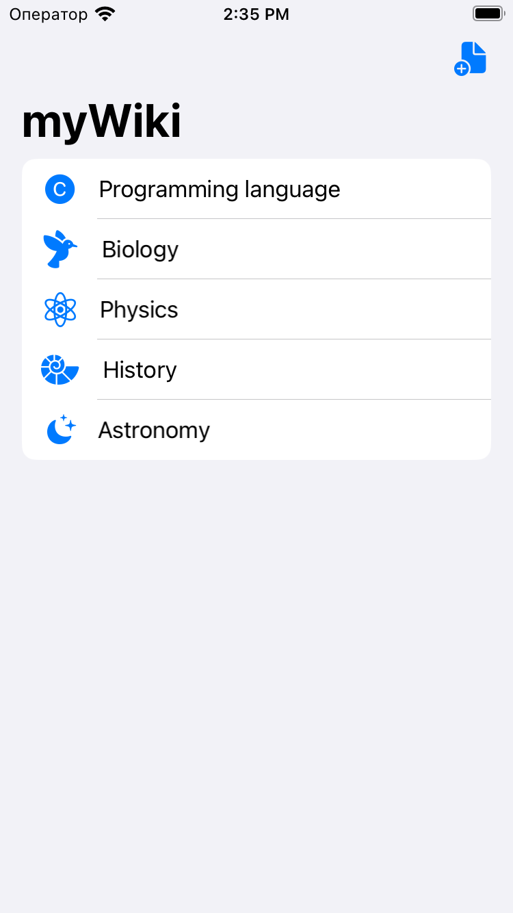
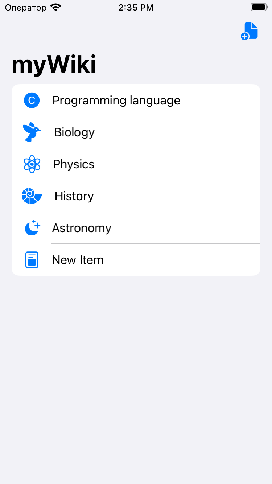
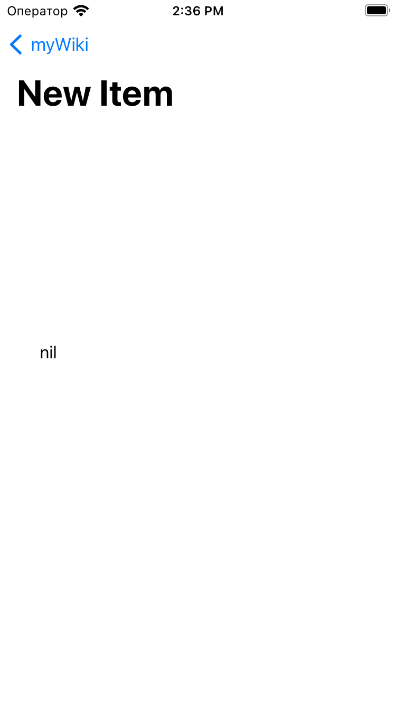
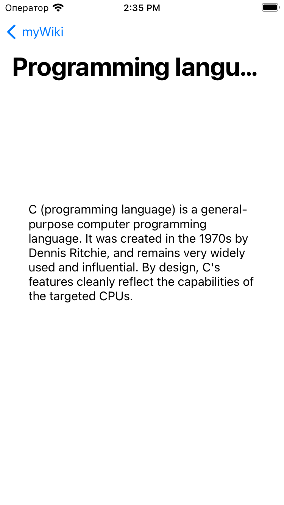
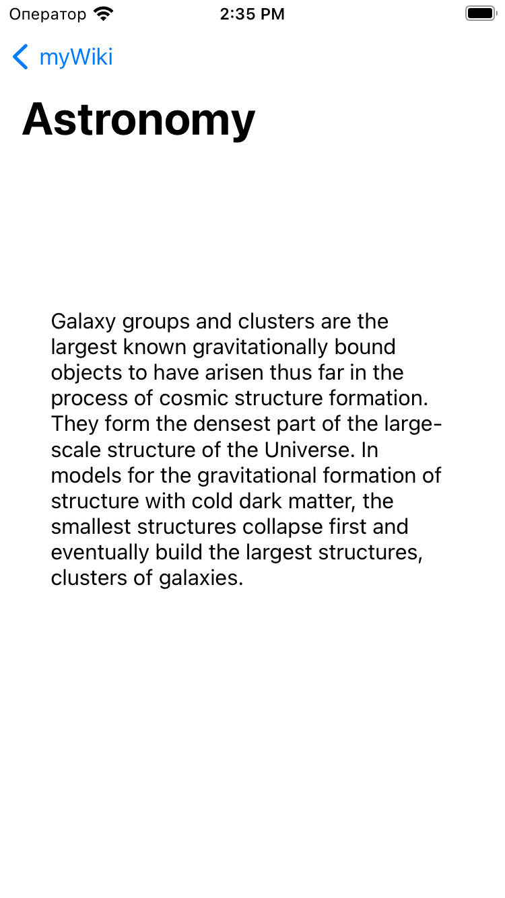

# Проект "myWiki"

Проект "myWiki" создан для изучения работы с таблицами в iOS-приложениях. Это приложение представляет собой простую вики с возможностью добавления статей и просмотра подробной информации о каждой статье.

## Описание проекта

Цель проекта - освоение основ работы с таблицами и навигацией в iOS-приложениях.

## Структура проекта

Проект состоит из следующих компонентов:

- **Data.swift:** Модель данных, представляющая статьи и их информацию.
- **ViewController.swift:** Главный контроллер, отображающий таблицу статей и обрабатывающий добавление новых статей.
- **SecondViewController.swift:** Контроллер для отображения подробной информации о статье.

## Изученные концепции

- Использование `UITableView` для отображения списка данных.
- Работа с `UITableViewCell` для кастомизации внешнего вида строк таблицы.
- Навигация между экранами с использованием `UINavigationController`.
- Обработка событий и взаимодействие с элементами интерфейса.

## Функциональность

Проект "myWiki" предоставляет следующую функциональность:

- **Главный экран:**
  - Отображение списка статей в виде таблицы.
  - Возможность добавления новых статей с помощью кнопки в правом верхнем углу.

  

Добавление новой статьи:

  
  

- **Статья:**
  - Просмотр подробной информации о выбранной статье.

  
  

## Запуск проекта

Для запуска проекта выполните следующие шаги:

1. Откройте проект в Xcode.
2. Убедитесь, что ViewController.swift выбран как основной контроллер интерфейса.
3. Запустите симулятор, выбрав устройство для запуска.
4. Интерфейс приложения "myWiki" будет отображен на экране.

