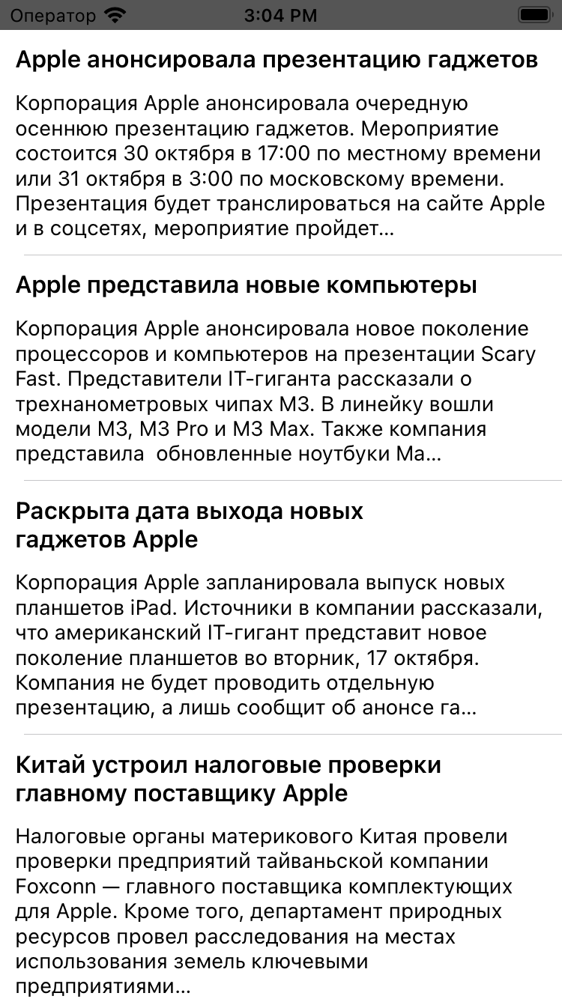
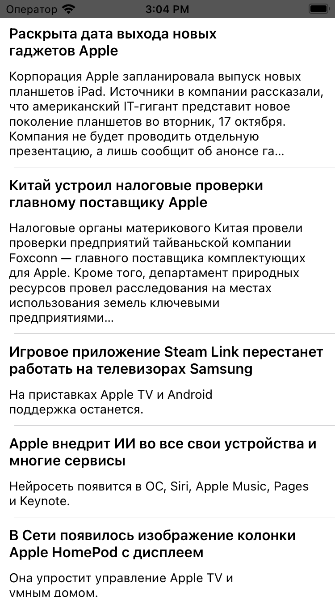

# Проект "NewsAPI"

Проект "NewsAPI" создан для изучения работы с `URLSession` в iOS-приложениях. Приложение использует новостное API для получения данных о новостях и отображения их в `UITableView`.

## Описание проекта

Цель проекта - освоение работы с сетевыми запросами через `URLSession`, обработка полученных данных и отображение их в пользовательском интерфейсе.

## Структура проекта

Проект включает в себя следующие компоненты:

- **News.swift:** Модель данных, представляющая информацию о новостях.
- **APIManager.swift:** Менеджер для выполнения сетевых запросов к новостному API.
- **TableCell.swift:** Класс для создания кастомных ячеек UITableView для отображения новостей.
- **ViewController.swift:** Главный контроллер, управляющий UITableView и обработкой данных.

## Изученные концепции

- Использование `URLSession` для выполнения сетевых запросов.
- Обработка данных JSON с использованием `Codable`.
- Создание модели данных для удобной работы с полученными данными.
- Отображение данных в `UITableView`.
- Обработка ошибок и обновление пользовательского интерфейса после получения данных.

## Функциональность

Проект "NewsAPI" предоставляет следующую функциональность:

- **Главный экран:**
  - Отображение списка новостей в виде `UITableView`.
  - Кастомные ячейки, содержащие заголовок, описание и другую информацию о новости.
  - Загрузка данных о новостях через NewsAPI и обновление пользовательского интерфейса.

  
  

## Запуск проекта

Для запуска проекта выполните следующие шаги:

1. Откройте проект в Xcode.
2. Убедитесь, что ViewController.swift выбран как основной контроллер интерфейса.
3. Запустите симулятор, выбрав устройство для запуска.
4. Интерфейс приложения "NewsAPI" с отображением новостей будет отображен на экране.

## Дополнительные исследования

Проект может быть расширен и дополнен следующим образом:

- Реализация дополнительных функций фильтрации и сортировки новостей.
- Добавление возможности открытия полной статьи при нажатии на новость.
- Разработка механизма обновления новостей с использованием pull-to-refresh.
