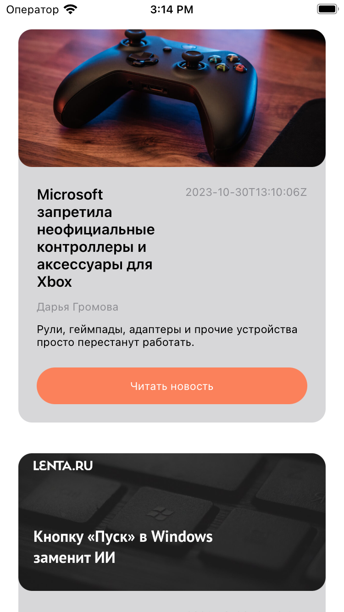
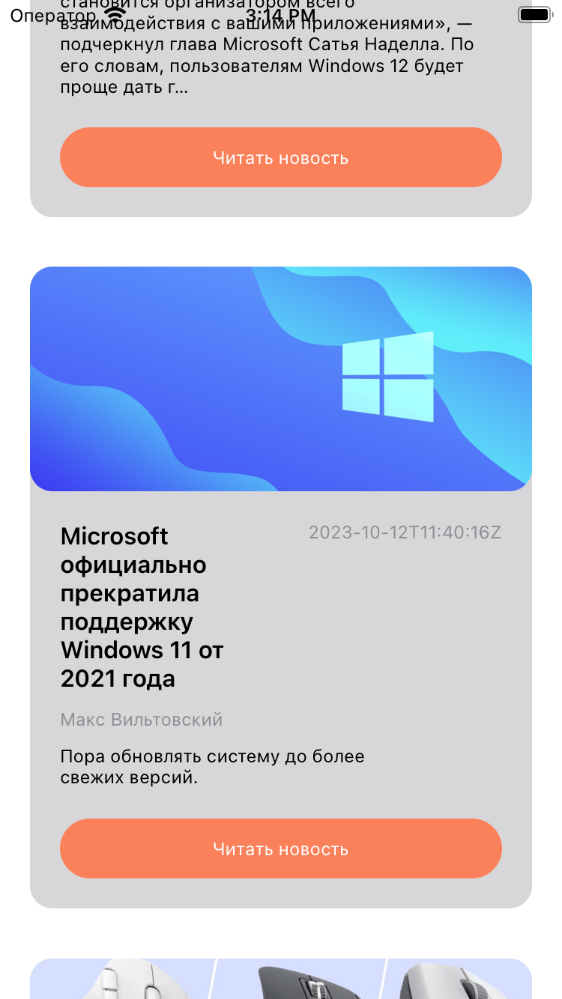

# Проект "News"

Проект "News" создан для изучения работы с сетевыми запросами через `URLSession` и `Alamofire`, а также для загрузки и отображения изображений с использованием библиотеки `sdWebImage` в iOS-приложениях. Приложение использует новостное API для получения данных о новостях и отображения их в `UICollectionView`.

## Описание проекта

Цель проекта - овладение основными концепциями работы с сетью в iOS-приложениях, в том числе использование библиотеки `Alamofire` для упрощения сетевых запросов, а также интеграция sdWebImage для эффективной загрузки и отображения изображений.

## Структура проекта

Проект включает в себя следующие компоненты:

- **News.swift:** Модель данных, представляющая информацию о новостях.
- **ManagerAPI.swift:** Менеджер для выполнения сетевых запросов к новостному API с использованием URLSession и Alamofire.
- **CollectionCell.swift:** Класс для создания кастомных ячеек UICollectionView для отображения новостей.
- **ViewController.swift:** Главный контроллер, управляющий UICollectionView и обработкой данных.

## Изученные концепции

- Использование `URLSession` и `Alamofire` для выполнения сетевых запросов.
- Обработка данных JSON с использованием `Codable`.
- Создание модели данных для удобной работы с полученными данными.
- Использование библиотеки `sdWebImage` для загрузки и кэширования изображений.
- Отображение данных в `UICollectionView`.

## Функциональность

Проект "News" предоставляет следующую функциональность:

- **Главный экран:**
  - Отображение сетки новостей в виде `UICollectionView`.
  - Кастомные ячейки, содержащие изображение, заголовок, автора, дату публикации и текст новости.
  - Загрузка данных о новостях через NewsAPI и отображение их в `UICollectionView`.
  - Загрузка изображений с использованием `sdWebImage` для эффективного кэширования.

  
  

## Запуск проекта

Для запуска проекта выполните следующие шаги:

1. Откройте проект в Xcode.
2. Убедитесь, что ViewController.swift выбран как основной контроллер интерфейса.
3. Запустите симулятор, выбрав устройство для запуска.
4. Интерфейс приложения "News" с отображением новостей будет отображен на экране.

## Дополнительные исследования

Проект может быть расширен и дополнен следующим образом:

- Реализация функции обновления новостей с использованием pull-to-refresh.
- Добавление дополнительных параметров для сортировки и фильтрации новостей.
- Интеграция функционала открытия полной статьи при нажатии на новость.
