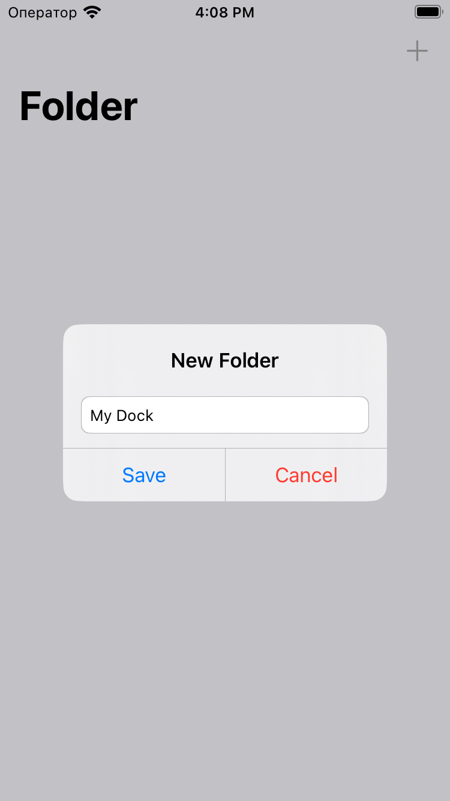
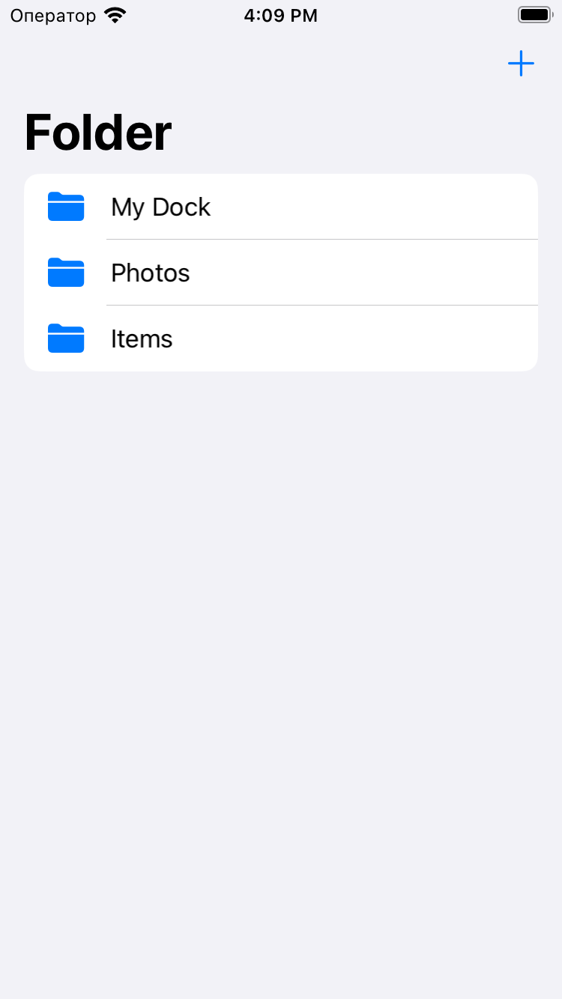
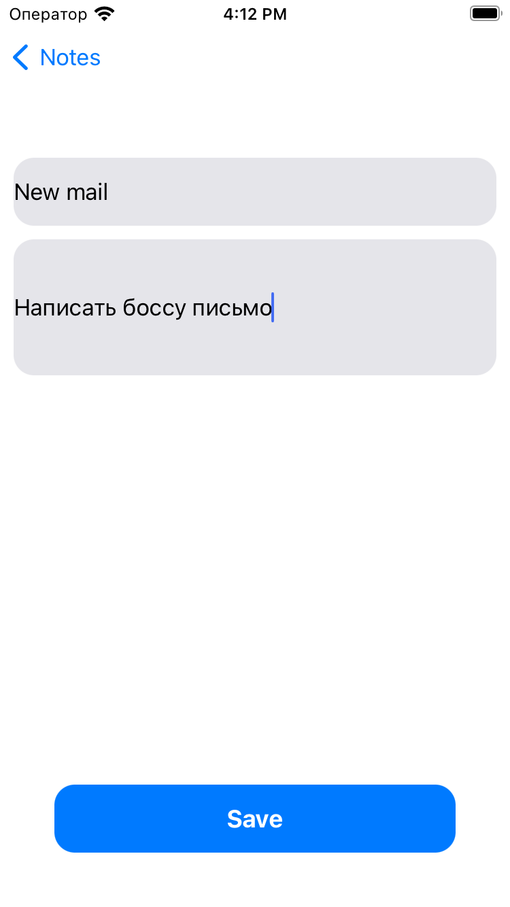
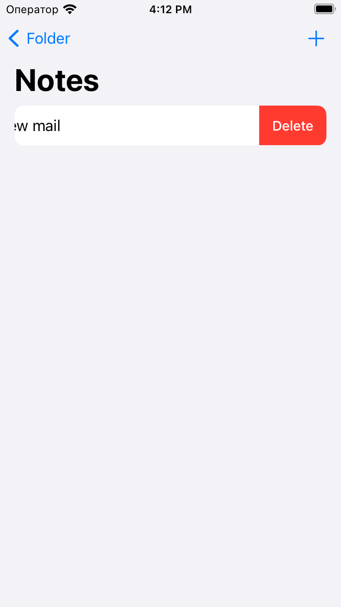

# Проект "Folders"

Проект "Folders" создан для изучения работы с базой данных `Realm` в iOS-приложениях, а также для создания простого файлового менеджера. Приложение позволяет создавать и управлять папками и документами, а также хранить текстовые сообщения внутри документов.

## Описание проекта

Цель проекта - овладение основами хранения данных в мобильных приложениях с использованием `Realm`. Пользователь может создавать папки, в которых хранятся документы, а также создавать текстовые документы с различной информацией.

## Структура проекта

Проект включает в себя следующие компоненты:

- **Folder.swift:** Модель данных, представляющая информацию о папках.
- **Note.swift:** Модель данных, представляющая информацию о текстовых документах.
- **RealmManager.swift:** Менеджер для выполнения операций чтения и записи данных с использованием `Realm`.
- **ViewController.swift:** Контроллер для отображения и управления папками и документами.

## Изученные концепции

- Использование `Realm` для хранения данных в приложении.
- Создание моделей данных с использованием `RealmObject`.
- Выполнение операций чтения и записи данных с использованием `RealmManager`.
- Организация связей между моделями данных (например, хранение документов внутри папок).
- Отображение данных в `UITableView` с использованием `RealmResults`.
- Работа с интерфейсом пользователя для добавления и удаления папок и документов.

  
  
  
  

## Функциональность

Проект "Folders" предоставляет следующую функциональность:

- **Главный экран:**
  - Отображение списка папок и документов в виде `UITableView`.
  - Создание новых папок и текстовых документов.
  - Удаление папок и документов из приложения.

## Запуск проекта

Для запуска проекта выполните следующие шаги:

1. Откройте проект в Xcode.
2. Убедитесь, что ViewController.swift выбран как основной контроллер интерфейса.
3. Запустите симулятор, выбрав устройство для запуска.
4. Интерфейс приложения "Folders" с папками и документами будет отображен на экране.

## Дополнительные исследования

Проект может быть расширен и дополнен следующим образом:

- Добавление дополнительных атрибутов для документов (например, дата создания).
- Внедрение функционала редактирования и перемещения папок и документов.
- Реализация поиска и сортировки для удобного управления данными.
